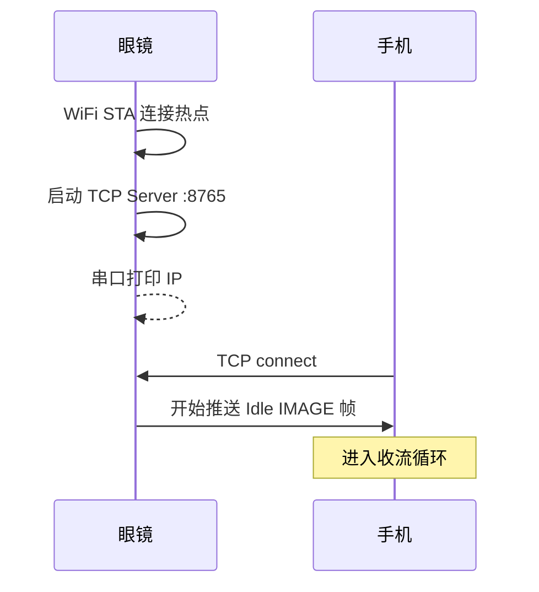
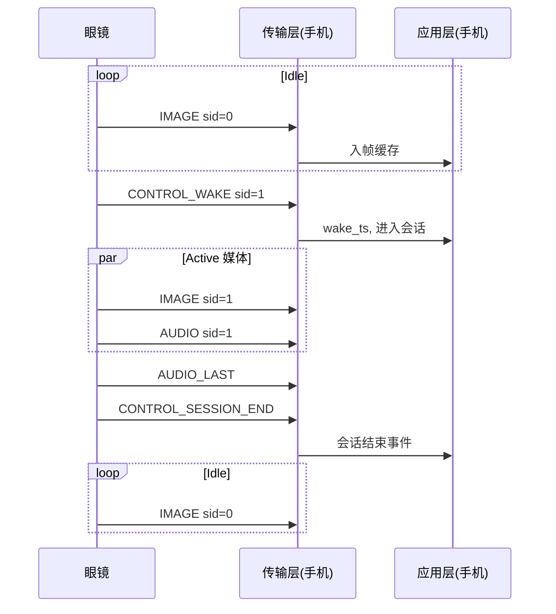

# JuneGlass MVP 传输层规格：眼镜 ↔ 手机

## 1. 文档定位

本文档定义 JuneGlass MVP 阶段 **眼镜端与手机端之间的传输层契约**，是两端联调的共同依据。

| 项 | 说明 |
|----|------|
| 范围 | 连接模型、帧协议、会话边界、双端职责、错误处理 |
| 不覆盖 | STT、选帧算法、MiniCPM、TTS（属手机端应用层，见 [`phone-requirement-mvp.md`](./phone-requirement-mvp.md)） |
| 不覆盖 | 摄像头/麦克风驱动、升档状态机实现细节（属眼镜端，见 [`glass-requirement-mvp.md`](./glass-requirement-mvp.md)） |

关联文档：

- 系统总览：[`requirement-mvp.md`](./requirement-mvp.md)
- 眼镜端需求：[`glass-requirement-mvp.md`](./glass-requirement-mvp.md)
- 手机端需求：[`phone-requirement-mvp.md`](./phone-requirement-mvp.md)

本期物理层固定 **WiFi + TCP**；下期 BLE 接入时 **应用层帧格式不变**，仅替换物理承载（见 §3.4）。

---

## 2. 传输层在系统中的位置

```text
┌─────────────────────────────────────────────────────────────┐
│  手机应用层：帧缓存 / STT / 提问检测 / 选帧 / MiniCPM / TTS   │  ← 不在本文档
├─────────────────────────────────────────────────────────────┤
│  手机传输层：TCP Client / 拆包 / 分发 / 重连 / 接收背压        │  ← 本文档 §6
├─────────────────────────────────────────────────────────────┤
│                      WiFi LAN / TCP :8765                    │  ← 本文档 §4
├─────────────────────────────────────────────────────────────┤
│  眼镜传输层：TCP Server / 封包 / 发送队列 / 连接管理           │  ← 本文档 §5
├─────────────────────────────────────────────────────────────┤
│  眼镜应用层：采图 / 采音 / 会话状态机 / 升档 / 唤醒触发       │  ← 不在本文档
└─────────────────────────────────────────────────────────────┘
```

**传输层的唯一职责**：在可靠字节流上，按约定格式传递 IMAGE / AUDIO / CONTROL 帧，并维护连接与会话边界。不在此层做语义理解。

---

## 3. 边界设计总览

MVP 在眼镜与手机之间存在 **8 条显式边界**。联调争议应首先对照本节判定归属。

### 3.1 边界一览

| # | 边界名称 | 契约内容 | 眼镜端 | 手机端 |
|---|----------|----------|--------|--------|
| B1 | **物理承载** | 本期 WiFi STA + TCP | 连热点、开 Server | 做 Client 连接 |
| B2 | **应用分帧** | 14 字节头 + payload | 封包、发送 | 拆包、校验、分发 |
| B3 | **媒体时序** | Idle 仅 IMAGE；Active 图+音 | 按状态机决定发什么 | 按 type 接入不同缓冲 |
| B4 | **会话生命周期** | WAKE → … → SESSION_END | 生成 session、驱动升档 | 解析 session、关联图音 |
| B5 | **时间参考** | `timestamp_ms` 为眼镜单调时钟 | 打戳 | 用于选帧窗口，不做 NTP 同步 |
| B6 | **控制方向** | 本期仅眼镜 → 手机 | 发 CONTROL 帧 | 接收并更新本地会话状态 |
| B7 | **配置与参数** | 不传运行时配置 | 编译宏 / 串口 | App 配置 / 本地常量 |
| B8 | **背压与恢复** | TCP 流控 + 丢帧策略 | 发送失败丢帧；断线继续采集 | 读循环不阻塞；断线重连 |

### 3.2 边界之外（明确不属于传输层）

以下能力 **不得** 在传输层实现，否则会导致双端耦合或职责混乱：

| 能力 | 归属 |
|------|------|
| 唤醒词检测 | 眼镜应用层（本期按键模拟） |
| 有效提问判断 | 手机应用层 |
| 选帧 / 清晰度算法 | 手机应用层 |
| JPEG 质量选档逻辑 | 眼镜应用层 |
| 模型推理 / TTS | 手机应用层 |
| 用户身份 / 鉴权 | MVP 不做 |

### 3.3 下期将新增、本期不实现的边界

| 边界 | 说明 |
|------|------|
| **承载切换** | Idle 走 BLE、Active 走 WiFi；需新增 `CONTROL_TRANSPORT_SWITCH`（待定） |
| **手机 → 眼镜控制** | 如远程结束会话、调整帧率；本期无反向 CONTROL |
| **应用层 ACK** | 如手机确认收到 WAKE；本期 TCP 可靠传输即足够 |
| **安全边界** | TLS / 配对鉴权；本期局域网明文 TCP |
| **时钟同步** | 跨端绝对时间对齐；本期仅用眼镜相对时间戳 |

### 3.4 物理承载与协议解耦原则

```text
应用帧协议（JG 帧） ── 本期、下期共用，不随承载变化
        ↓
物理承载         ── 本期：WiFi/TCP
                   下期：Idle=BLE，Active=WiFi/TCP（或双通道并行）
```

---

## 4. 连接边界（B1）

### 4.1 连接参数

| 项 | 眼镜端（Server） | 手机端（Client） |
|----|------------------|------------------|
| 传输层 | TCP | TCP |
| 角色 | 监听 `0.0.0.0:8765` | 主动 `connect(glasses_ip, 8765)` |
| 连接数 | 单 Client；新连接接入时关闭旧连接 | 单连接；断线后重连 |
| 字节序 | 小端 | 小端 |
| WiFi | STA，连接手机热点 | 热点或同 LAN AP |

### 4.2 发现与连接流程



| 步骤 | 眼镜端 | 手机端 |
|------|--------|--------|
| 1 | 连 WiFi，绑定端口 | 获取眼镜 IP（串口 / mDNS / 手动输入） |
| 2 | `listen()`，等待连接 | `connect()` |
| 3 | 连接建立后立即推流 | 启动读循环，不等待「握手帧」 |
| 4 | 断线后继续采集，等待重连 | 指数退避重连（建议 1s → 2s → 4s，上限 30s） |

### 4.3 本期无连接握手

- **不存在** 独立 Hello / 能力协商帧
- 连接建立后眼镜直接发 `IMAGE` 或当前状态对应媒体帧
- 手机通过首帧 `magic == "JG"` 校验协议

### 4.4 重连边界（B8 之一）

| 场景 | 眼镜端 | 手机端 |
|------|--------|--------|
| TCP 断开 | 不重启状态机；按当前 Idle/Active 继续采集；新连接建立后继续推流 | 清空**会话级**缓冲（音频拼接、当前 session）；**保留**帧缓存环形队列 |
| 重连后 session | 可能处于 Active 中途；继续当前 `session_id` 推流 | 以新收到的 `CONTROL_WAKE` 或 `session_id` 变化为准重新对齐 |
| 重连期间丢帧 | 预期行为 | 帧缓存继续由新 IMAGE 填充 |

---

## 5. 眼镜端传输层职责

### 5.1 必做

| 职责 | 说明 |
|------|------|
| 封包 | 所有出站数据必须带完整 14 字节头 |
| 单调时间戳 | `timestamp_ms` 使用眼镜启动后 `millis()`，不回绕前保持一致 |
| session 管理 | Idle 帧 `session_id=0`；每次唤醒递增 |
| 发送顺序约束 | 同一 `session_id` 内：`CONTROL_WAKE` 必须早于首包 Active `IMAGE`/`AUDIO` |
| 非阻塞发送 | 发送缓冲区满时**丢当前帧**，不阻塞采集任务 |
| 断线容忍 | 无 Client 时继续采集；有 Client 时发送 |

### 5.2 禁止

| 禁止 | 原因 |
|------|------|
| 在发送路径做 STT / 选帧 | 属手机应用层 |
| 等待手机 ACK 再发下一帧 | MVP 无反向控制 |
| 在 TCP 发送中做 JPEG 编码 | 编码在采集任务，发送仅 IO |
| 发送 `payload_len > 512KB` 的帧 | 防止异常撑爆手机缓冲 |

### 5.3 媒体发送规则（B3）

| 眼镜状态 | 发送帧类型 | flags 约定 |
|----------|------------|------------|
| `IDLE_STREAM` | 仅 `IMAGE` | `STREAM_IDLE=1`，约 1fps QVGA |
| `SESSION_ACTIVE` | `IMAGE` + `AUDIO` | `STREAM_IDLE=0`；末包 AUDIO 置 `AUDIO_LAST` |
| 升档切换中 | 允许 0.3–0.5s 无 IMAGE | 正常，手机用缓存兜底 |

---

## 6. 手机端传输层职责

### 6.1 必做

| 职责 | 说明 |
|------|------|
| 读循环 | `read(14)` → 校验 magic/version → `read(payload_len)` |
| 帧校验 | `magic=="JG"`、`version==1`、`payload_len <= 512KB` |
| 按 type 分发 | 推入不同下游缓冲（见 §6.3） |
| 非阻塞读 | 独立线程/协程；读循环不得被 STT/推理阻塞 |
| 会话跟踪 | 维护 `current_session_id`、`wake_timestamp_ms` |
| 重连 | 断线后自动重连，恢复收流 |

### 6.2 禁止

| 禁止 | 原因 |
|------|------|
| 在读循环中做 STT / MiniCPM | 属应用层，阻塞将导致 TCP 接收缓冲堆积 |
| 假设 `recv` 一次返回一整帧 | TCP 是字节流，必须按长度粘包 |
| 在传输层判断「是否为有效提问」 | 属手机应用层 |
| 修改 JPEG 后写回眼镜 | 本期无反向通道 |

### 6.3 帧分发与下游边界

传输层解析完成后，**仅负责投递到对应缓冲**，不做业务处理：

```text
IMAGE      → image_ring_buffer（容量 3–5 帧，附 ts / sid / flags / clarity 元信息）
AUDIO      → session_audio_buffer[session_id]（按 sid 拼接 PCM）
CONTROL_WAKE   → 更新 session 状态，记录 wake_ts，通知应用层
CONTROL_SESSION_END → 关闭当前 session 音频期待，通知应用层
```

| 帧类型 | 传输层交付物 | 应用层接管后动作（不在本文档实现） |
|--------|--------------|-----------------------------------|
| IMAGE | 原始 JPEG + 元信息入环形缓冲 | 清晰度打分、选帧 |
| AUDIO | PCM 块追加到 session 缓冲 | STT |
| CONTROL_WAKE | `wake_ts`、`session_id`、升档参数 | 标记选帧窗口 |
| CONTROL_SESSION_END | 会话结束事件 | 触发 STT 收尾 / 分析（若已满足条件） |

### 6.4 手机端收流状态机

```text
DISCONNECTED → CONNECTING → RECEIVING_IDLE
                                │
                    收到 CONTROL_WAKE
                                ↓
                         RECEIVING_SESSION
                                │
                    收到 CONTROL_SESSION_END
                                ↓
                         RECEIVING_IDLE
```

| 状态 | 传输层行为 |
|------|------------|
| `RECEIVING_IDLE` | 只积累 IMAGE 到环形缓冲；忽略 AUDIO（不应出现） |
| `RECEIVING_SESSION` | IMAGE 继续入缓冲；AUDIO 按 sid 拼接 |
| 任意 | 断线 → `DISCONNECTED` → 重连 |

---

## 7. 会话边界（B4）

### 7.1 会话定义

一次 **会话（Session）** 指：从 `CONTROL_WAKE` 到 `CONTROL_SESSION_END` 的封闭区间，对应用户一次唤醒交互。

| 字段 | 产出方 | 消费方 | 说明 |
|------|--------|--------|------|
| `session_id` | 眼镜 | 手机 | uint16 递增；Idle 帧为 0 |
| `wake_timestamp_ms` | 眼镜（WAKE 帧头） | 手机 | 选帧锚点，见 §8 |
| 会话时长 | 眼镜控制 | 手机被动 | 眼镜端约 8s 超时或 VAD/按键结束 |

### 7.2 session_id 规则

| 规则 | 说明 |
|------|------|
| Idle IMAGE | `session_id = 0` |
| 每次唤醒 | `session_id++`（uint16 回绕） |
| 同会话 | WAKE 到 END 之间所有 IMAGE/AUDIO 共用同一 sid |
| 手机拼接音频 | 只拼接当前活跃 `session_id` 的 AUDIO 块 |
| END 之后 | 眼镜恢复 `sid=0` 的 Idle IMAGE |

### 7.3 双端会话对齐义务

| 事件 | 眼镜义务 | 手机义务 |
|------|----------|----------|
| 唤醒 | 先发送 `CONTROL_WAKE`，再发 Active 媒体 | 收到 WAKE 后切换至 `RECEIVING_SESSION` |
| 升档间隙 | 允许短暂无 IMAGE | 不判为错误；用唤醒前缓存选帧 |
| 音频结束 | 末包 AUDIO 置 `AUDIO_LAST`；随后发 `SESSION_END` | 收到 `AUDIO_LAST` 或 `END` 后停止等待更多 AUDIO |
| 超时 | 眼镜主动发 `SESSION_END` | 收到 END 后回落 IDLE 收流态 |

---

## 8. 时间边界（B5）

### 8.1 约束

- `timestamp_ms` 是 **眼镜本地单调时钟**，两端 **不做** NTP 或时钟同步
- 手机 **不得** 用本机 wall clock 与眼镜 ts 直接比较绝对时间
- 手机 **可以** 用「同一连接内收到的帧的 ts 差值」做相对窗口

### 8.2 选帧窗口（传输层 → 应用层契约）

传输层向应用层暴露 `wake_timestamp_ms`（来自 WAKE 帧头）。应用层选帧窗口：

```text
[wake_ts - 1000ms, wake_ts + 2000ms]
```

此窗口属 **应用层消费约定**，由 [`phone-requirement-mvp.md`](./phone-requirement-mvp.md) 细化；传输层只保证 WAKE 帧 ts 正确传递。

### 8.3 IMAGE 帧 ts 与采集时刻

- `timestamp_ms` 在 JPEG 抓取完成时打戳
- 允许发送延迟导致 ts 与 TCP 到达时间不一致；选帧以 **帧头 ts** 为准，不以手机接收时间为准

---

## 9. 控制边界（B6）

### 9.1 本期控制方向：单向（眼镜 → 手机）

| 帧 | 触发方 | 手机响应 |
|----|--------|----------|
| `CONTROL_WAKE` | 眼镜（按键/下期唤醒词） | 进入会话收流态；记录 wake_ts |
| `CONTROL_SESSION_END` | 眼镜（超时/句末/强制结束） | 结束会话收流态 |

### 9.2 本期无反向控制

手机 **不发送** 任何 CONTROL 帧给眼镜。以下需求 **不能** 通过传输层实现：

- 手机远程触发唤醒
- 手机请求提帧率 / 降分辨率
- 手机 ACK「分析完成」通知眼镜

上述若需实现，放入下期并扩展新 `type`（如 `0x20` 段留给手机→眼镜）。

### 9.3 配置边界（B7）

| 配置项 | 配置方式 |
|--------|----------|
| WiFi SSID/密码 | 眼镜编译宏或烧录配置；手机热点设置 |
| 端口 | 默认 8765，双端常量一致 |
| Idle/Active 分辨率帧率 | 眼镜固件；通过 WAKE payload 告知手机预期值 |
| 手机选帧/TTS 参数 | 手机 App 本地配置，不在协议中传递 |

---

## 10. 帧协议（B2）

### 10.1 帧头（14 字节）

```text
偏移  长度  字段            类型        说明
0     2     magic           char[2]     固定 "JG" (0x4A 0x47)
2     1     version         uint8       本期 = 0x01
3     1     type            uint8       见 §10.2
4     1     flags           uint8       见 §10.3
5     4     timestamp_ms    uint32      眼镜单调毫秒
9     2     session_id      uint16      会话 ID
11    4     payload_len     uint32      payload 字节数
```

### 10.2 帧类型（type）

| 值 | 名称 | 方向 | payload |
|----|------|------|---------|
| `0x01` | `IMAGE` | 眼镜 → 手机 | JPEG 字节流 |
| `0x02` | `AUDIO` | 眼镜 → 手机 | PCM s16le, 16kHz, mono |
| `0x10` | `CONTROL_WAKE` | 眼镜 → 手机 | 8 字节，见 §10.5 |
| `0x11` | `CONTROL_SESSION_END` | 眼镜 → 手机 | 空 |

保留：`0x03–0x0F` 媒体扩展；`0x20–0x2F` 手机→眼镜控制；`0x30+` 承载切换。

### 10.3 标志位（flags）

| 位 | 名称 | 说明 |
|----|------|------|
| bit 0 | `STREAM_IDLE` | `1` = Idle 档 IMAGE；`0` = Active 档 |
| bit 1 | `AUDIO_LAST` | `1` = 本会话最后一个 AUDIO 块 |
| bit 2–7 | 保留 | 置 0 |

### 10.4 Payload：IMAGE / AUDIO

**IMAGE**

| 项 | 值 |
|----|-----|
| 格式 | JPEG |
| Idle 典型 | QVGA，8–15 KB |
| Active 典型 | VGA，25–45 KB |

**AUDIO**

| 项 | 值 |
|----|-----|
| 编码 | PCM signed 16-bit LE |
| 采样率 | 16000 Hz |
| 声道 | mono |
| 分块建议 | 320–640 ms/块（5120–10240 字节） |

### 10.5 Payload：CONTROL_WAKE（8 字节）

```text
偏移  长度  字段            说明
0     1     capture_mode    1 = Active（升档后）
1     1     reserved        0
2     2     image_width     如 640
4     2     image_height    如 480
6     2     image_fps_x10   帧率×10，如 25 = 2.5fps
```

手机用此校验升档是否符合预期，**不在传输层修改眼镜行为**。

### 10.6 封包 / 拆包参考

**眼镜（C）**

```c
void send_frame(int sock, uint8_t type, uint8_t flags,
                uint32_t ts, uint16_t sid,
                const uint8_t *payload, uint32_t len) {
    uint8_t hdr[14];
    hdr[0] = 0x4A; hdr[1] = 0x47;
    hdr[2] = 0x01;
    hdr[3] = type;
    hdr[4] = flags;
    memcpy(&hdr[5],  &ts,  4);
    memcpy(&hdr[9],  &sid, 2);
    memcpy(&hdr[11], &len, 4);
    send_all(sock, hdr, 14);
    if (len > 0) send_all(sock, payload, len);
}
```

**手机（Python 拆包）**

```python
import struct

def read_frame(sock, recv_all):
    hdr = recv_all(14)
    magic, ver, ftype, flags, ts, sid, plen = struct.unpack("<2sBBBIHI", hdr)
    if magic != b"JG" or ver != 1:
        raise ProtocolError("invalid header")
    if plen > 512 * 1024:
        raise ProtocolError("payload too large")
    payload = recv_all(plen) if plen else b""
    return {"type": ftype, "flags": flags, "ts": ts,
            "sid": sid, "payload": payload}
```

---

## 11. 背压与性能边界（B8）

### 11.1 原则

```text
TCP 接收缓冲堆积  ←  手机读循环太慢（应用层阻塞）
TCP 发送阻塞      ←  网络差或手机不读；眼镜应丢帧而非阻塞采集
```

### 11.2 眼镜端

| 策略 | 说明 |
|------|------|
| `grab_mode = LATEST` | 采集侧丢旧帧 |
| 发送失败 | 跳过本帧，记录计数，不重试阻塞 |
| 采集与发送分离 | 采集任务写环形缓冲；发送任务读缓冲 |

### 11.3 手机端

| 策略 | 说明 |
|------|------|
| 独立收流线程 | 只做 read + 拆包 + 入缓冲 |
| IMAGE 缓冲上限 | 3–5 帧，满则覆盖最旧 |
| AUDIO 缓冲上限 | 单 session 最大 10s 音频（约 320KB），超出丢弃并告警 |
| 应用层慢 | 不允许反向阻塞读循环 |

---

## 12. 端到端时序

### 12.1 Idle 期间

```text
眼镜 ──IMAGE(sid=0, STREAM_IDLE)──► 手机 → image_ring_buffer
（约 1 fps，持续）
```

### 12.2 完整会话

```text
... Idle IMAGE 持续 ...
眼镜 ──CONTROL_WAKE(sid=1, ts=wake_ts)──► 手机：进入 RECEIVING_SESSION
眼镜 ──IMAGE(sid=1, Active)────────────► 手机：image_ring_buffer
眼镜 ──AUDIO(sid=1, chunk)─────────────► 手机：session_audio_buffer[1]
  ... IMAGE / AUDIO 交错 ...
眼镜 ──AUDIO(sid=1, AUDIO_LAST)────────► 手机：标记音频结束
眼镜 ──CONTROL_SESSION_END(sid=1)──────► 手机：回落 RECEIVING_IDLE
眼镜 ──IMAGE(sid=0, STREAM_IDLE)───────► 手机：继续缓存
```



### 12.3 传输层与应用层触发关系

| 传输层事件 | 应用层是否立即分析 |
|------------|-------------------|
| 收到 WAKE | 否；等待 STT 有效提问 |
| 收到 AUDIO_LAST | 否；STT 可能仍在处理 |
| STT 判定有效提问 | 是；从 image_ring_buffer 选帧 → 分析 |
| 收到 SESSION_END | 若已有有效提问且在分析中，不中断；否则丢弃未完成会话 |

**分析触发不属传输层**，但传输层须保证 SESSION_END 后 AUDIO 不再追加。

---

## 13. 错误处理

| 场景 | 眼镜端 | 手机端 |
|------|--------|--------|
| magic/version 错误 | — | 断开连接，告警 |
| payload_len 超限 | 不得发送 | 断开连接 |
| 收到未知 type | — | 跳过该帧 payload，记录日志 |
| 收到 Idle 态 AUDIO | 不应发生 | 丢弃，记录警告 |
| 收到 Active 态无 WAKE | 协议违规 | 丢弃 AUDIO；IMAGE 仍入缓存 |
| session_id 回绕 | 正常 | 按新 sid 新建音频缓冲 |
| 半包/断连 | 等待重连 | recv 返回 0 → 重连 |
| WAKE 后长期无 IMAGE | 升档失败？ | 用唤醒前缓存 + 超时告警 |

---

## 14. 版本与兼容

| version | 说明 |
|---------|------|
| `0x01` | 本期：WiFi/TCP，4 种 type |

扩展规则：

- 不修改已有字段偏移
- 新增 type / flags 位，旧端忽略未知 type
- 不兼容变更时递增 `version`；手机遇未知 version 拒绝连接

---

## 15. 调试与验收

### 15.1 眼镜串口

| 命令/日志 | 说明 |
|-----------|------|
| `w` | 模拟唤醒 |
| `e` | 强制结束会话 |
| 日志 | WiFi IP、连接/断开、session_id、丢帧计数 |

### 15.2 手机 / 脚本验收清单

| # | 检查项 |
|---|--------|
| 1 | 能持续拆包 Idle IMAGE ≥ 5 分钟 |
| 2 | 能正确解析 WAKE payload |
| 3 | 能按 sid 拼接 AUDIO，AUDIO_LAST 正确 |
| 4 | SESSION_END 后会话态回落 |
| 5 | 人为断开 TCP 后重连可恢复收流 |
| 6 | 读循环在 Mock 慢分析时仍能持续收流 |

### 15.3 Python 收包脚本

```python
#!/usr/bin/env python3
"""用法: python3 recv_stream.py <glasses-ip> [port]"""
import socket, struct, sys

def recv_all(sock, n):
    buf = b""
    while len(buf) < n:
        chunk = sock.recv(n - len(buf))
        if not chunk:
            raise EOFError("connection closed")
        buf += chunk
    return buf

def main(host, port=8765):
    sock = socket.create_connection((host, port))
    img_count = 0
    while True:
        hdr = recv_all(sock, 14)
        magic, ver, ftype, flags, ts, sid, plen = struct.unpack("<2sBBBIHI", hdr)
        if magic != b"JG" or ver != 1:
            raise ValueError("bad header")
        payload = recv_all(sock, plen)
        names = {0x01: "IMAGE", 0x02: "AUDIO", 0x10: "WAKE", 0x11: "END"}
        print(f"{names.get(ftype, f'0x{ftype:02x}')} ts={ts} sid={sid} len={plen}")
        if ftype == 0x01:
            path = f"frame_{img_count:04d}.jpg"
            open(path, "wb").write(payload)
            img_count += 1

if __name__ == "__main__":
    main(sys.argv[1], int(sys.argv[2]) if len(sys.argv) > 2 else 8765)
```

---

## 16. 参数速查

| 参数 | 值 |
|------|-----|
| TCP 端口 | 8765 |
| Magic | `JG` |
| Protocol version | 1 |
| Idle 图 | QVGA 320×240, 1fps |
| Active 图 | VGA 640×480, 2.5fps |
| 音频 | PCM s16le, 16kHz, mono |
| 会话超时 | 8s（眼镜端） |
| 选帧窗口 | [wake_ts-1s, wake_ts+2s]（手机应用层） |
| 最大 payload | 512KB |

---

## 17. 文档索引

```text
transport-mvp.md              ← 本文档（传输层双端契约，首选入口）
requirement-mvp.md            系统总览
glass-requirement-mvp.md      眼镜端需求（采集/状态机）
phone-requirement-mvp.md      手机端需求（STT/选帧/推理）
```
